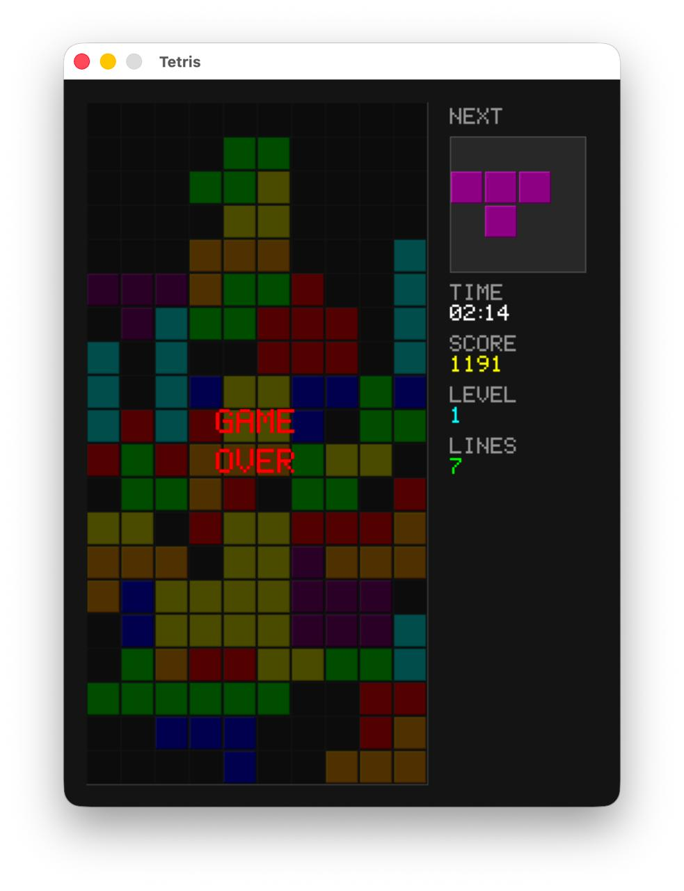

# Tetris

A totally vibecoded classic Tetris game built with C++17 and SDL2, featuring procedural audio generation for both sound effects and background music.

## 

## Features

- Classic Tetris gameplay with all 7 tetromino pieces (I, O, T, S, Z, J, L)
- Procedural sound effects
- Procedural EDM background music (128 BPM)
- Progressive difficulty with level system
- Classic scoring system

## Requirements

- C++17 compatible compiler
- CMake 3.15+
- Conan 2.x package manager

## Building

```bash
# Install dependencies
conan install . --output-folder=build --build=missing

# Configure and build
cmake --preset conan-release
cmake --build --preset conan-release

# Run
./build/build/Release/tetris
```

## Controls

| Key | Action |
|-----|--------|
| Left/Right Arrow | Move piece horizontally |
| Down Arrow | Soft drop |
| Up Arrow | Rotate clockwise |
| Space | Hard drop |
| Escape | Quit game |
| Enter/Space | Restart after game over |

## Scoring

- 1 line: 100 × level
- 2 lines: 300 × level
- 3 lines: 500 × level
- 4 lines (Tetris): 800 × level

Level increases every 10 lines cleared.

## Project Structure

```
src/
├── main.cpp        # Entry point
├── Game.cpp/h      # Game state and main loop
├── Board.cpp/h     # 10x20 grid and collision detection
├── Tetromino.cpp/h # Piece types and rotation
├── Renderer.cpp/h  # SDL2 rendering
├── Sound.cpp/h     # Procedural sound effects
└── Music.cpp/h     # Procedural background music
```

## License

MIT
